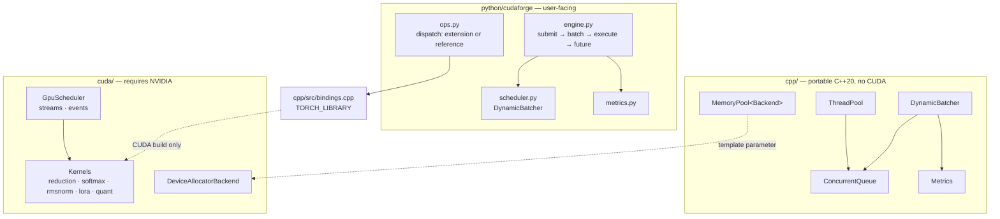

# Architecture

## Layering

## The load-bearing split

Everything in `cpp/` builds and is tested on any host with a C++20 compiler.
Everything under `cuda/` is guarded behind `CUDAFORGE_ENABLE_CUDA` and is never
a build prerequisite for the portable targets.

This is not tidiness. It is what makes the project developable and testable on a
machine with no NVIDIA hardware — which is the common case, and was the case
here. The concurrency runtime, which is where most of the subtle correctness
lives, gets full test and sanitizer coverage regardless of what GPU is present.

The same principle appears three more times:

| Boundary | Portable side | Hardware side |
| --- | --- | --- |
| `MemoryPool<Backend>` | caching, size classes, accounting, thread safety | two-line `cudaMalloc` backend |
| `cudaforge.ops` | reference implementations, dispatch, validation | compiled kernels |
| `InferenceEngine` / `ModelRunner` | queueing, batching, metrics, lifecycle | tokenisation and generation |

In each case the interesting logic sits on the portable side of the line and the
hardware-dependent part is small enough to review by eye.
