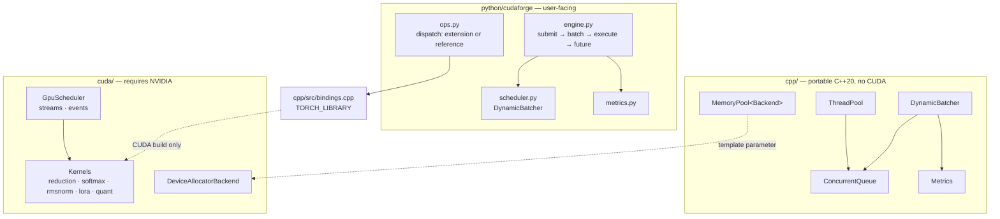

# Architecture

## Layering



## The load-bearing split

Everything in `cpp/` builds and is tested on any host with a C++20 compiler.
Everything under `cuda/` is guarded behind `CUDAFORGE_ENABLE_CUDA` and is never
a build prerequisite for the portable targets.

This is not tidiness. It is what makes the project developable and testable on a
machine with no NVIDIA hardware — which is the common case, and was the case
here. The concurrency runtime, which is where most of the subtle correctness
lives, gets full test and sanitizer coverage regardless of what GPU is present.

The same principle appears three more times:

| Boundary | Portable side | Hardware side |
| --- | --- | --- |
| `MemoryPool<Backend>` | caching, size classes, accounting, thread safety | two-line `cudaMalloc` backend |
| `cudaforge.ops` | reference implementations, dispatch, validation | compiled kernels |
| `InferenceEngine` / `ModelRunner` | queueing, batching, metrics, lifecycle | tokenisation and generation |

In each case the interesting logic sits on the portable side of the line and the
hardware-dependent part is small enough to review by eye.

## Request lifecycle

```mermaid
sequenceDiagram
    participant C as Client thread
    participant E as InferenceEngine
    participant B as DynamicBatcher
    participant W as Worker pool
    participant R as ModelRunner

    C->>E: submit(prompt)
    E->>E: register future
    E->>B: enqueue (blocks or sheds if full)
    B-->>C: Future returned immediately

    Note over B: accumulate until<br/>max_batch_size or max_wait
    B->>W: dispatch(batch)
    Note over B: returns at once;<br/>keeps forming the next batch
    W->>R: generate(prompts, settings)
    R-->>W: results
    W->>E: complete each future
    E-->>C: Response
```

Two properties this ordering guarantees:

**The future is registered before the request is enqueued.** The batcher thread
can pick a request up the instant it lands, and would otherwise find no future
to complete.

**The batcher never executes.** It hands the batch to the pool and returns. If
it executed inline, no batch could form during execution, and arrival-time
batching would collapse into strict serialisation — every batch a full one
assembled from the backlog that accumulated while the previous one ran.

## Where each concern lives

| Concern | Owner | Why there |
| --- | --- | --- |
| Admission and backpressure | `ConcurrentQueue` bound | the only place that can see the depth |
| Batch formation | `DynamicBatcher`, single thread | an inherently serial decision |
| Parallel execution | worker pool | independent per batch |
| GPU ordering | `GpuScheduler` streams | streams *are* the ordering primitive |
| Buffer reuse | `MemoryPool` | allocation is the thing being avoided |
| Timing and counters | `Metrics` | one place, so a snapshot is coherent |
| Result delivery | per-request futures | decouples completion from the caller's thread |
| Liveness vs readiness | `/health` vs `/ready` | a full queue means take me out of rotation, not restart me |

## Deviations from the requested layout

Three, each deliberate:

* **`inference/engine.py` and `inference/batching.py` do not exist.** The engine
  and batcher live in `python/cudaforge/`, because they are library code that
  the CLI, the examples and the benchmarks all import. Re-exporting them from
  `inference/` would have been two files of indirection. `inference/` holds only
  the HTTP adapter: `server.py` and `schemas.py`.

* **Headers sit under `cpp/include/cudaforge/` rather than `cpp/include/`.**
  Include paths read `#include "cudaforge/thread_pool.hpp"`, which prevents
  collisions with any other library's `metrics.hpp` or `request.hpp`.

* **`python/cudaforge/runners.py` was added.** The engine needs to be
  model-agnostic for its concurrency to be testable without downloading weights;
  the runner protocol is that seam.

## Failure isolation

Every boundary that crosses a thread has an explicit answer for "what if this
throws":

| Site | Behaviour | Reason |
| --- | --- | --- |
| Task in `ThreadPool` | counted, swallowed; worker survives | otherwise the pool loses capacity one task at a time until it deadlocks |
| Handler in `DynamicBatcher` | counted, swallowed; batcher survives | otherwise every subsequent request stalls in the queue until shutdown |
| Runner in `InferenceEngine` | every request in the batch is failed individually | each caller learns what happened; the engine keeps serving |
| Runner returns the wrong row count | treated as a batch failure | caught explicitly *inside* the guard — see below |
| CUDA call | throws `CudaError` with the status code | callers can distinguish recoverable OOM from a poisoned context |

The row-count case is worth singling out because it was a real bug found by its
own test. The zip that pairs requests with results originally sat outside the
try block, so a runner returning too few rows raised inside the executor, where
nothing completed the futures — every caller blocked until its timeout with no
error. The check now happens inside the guard, and the failure path settles
every future.

## Threading model summary

| Component | Threads | Synchronisation |
| --- | --- | --- |
| `ConcurrentQueue` | any | one mutex, two condition variables |
| `ThreadPool` | N workers | queue's mutex; relaxed atomics for counters |
| `DynamicBatcher` | exactly 1 | owns formation; no shared mutable state |
| `InferenceEngine` | 1 batcher + W workers | one mutex over the future registry, never held across generation |
| `Metrics` (C++) | any | relaxed atomics; histogram has its own mutex |
| `Metrics` (Python) | any | one lock; the GIL makes contention irrelevant |
| `GpuScheduler` | any | relaxed atomic counter for assignment; mutex for stats only |
| `MemoryPool` | any | one mutex over free lists and stats |

The pattern throughout: **atomics for independent counters on hot paths, a mutex
wherever an invariant spans more than one word.** A relaxed atomic is used only
where nothing is published through it — no reader establishes happens-before
from a counter.
