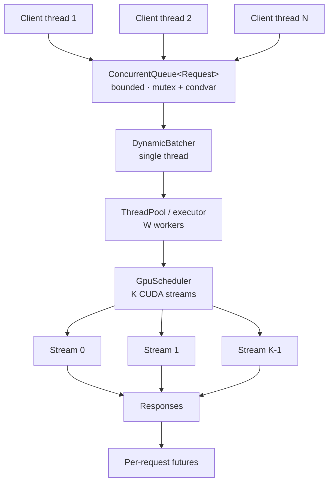

# Concurrency Architecture

How requests get from many client threads onto a GPU, and why each piece is
shaped the way it is.

## The pipeline

Each stage exists to decouple a rate mismatch:

| Stage | Decouples | Failure mode without it |
| --- | --- | --- |
| Bounded queue | arrival rate from service rate | unbounded latency, then OOM |
| Batcher | request granularity from GPU granularity | one kernel launch per request |
| Worker pool | batch formation from batch execution | formation stalls during execution |
| Stream scheduler | copies from compute | GPU idle during every transfer |

## Why a mutex, not atomics

The queue protects a composite invariant, not a single word. A producer must
observe "not closed AND not full" and then insert, with no window in between
where another thread could close the queue or take the last slot.

Atomics cannot express a check-then-act over two pieces of state. A lock-free
formulation would need a CAS over a value encoding both, plus a solution for
the ABA problem, and would still need somewhere for blocked producers to wait.
For a queue crossed once per request — not once per kernel — the mutex is not
on any hot path worth optimising.

The measurable claim is in `benchmarks/benchmark_queue.cpp`, which sweeps
producer and consumer counts and shows where the single lock stops scaling. If
that point sits below the target concurrency, the fix is sharding the queue,
not removing the lock.

## Why condition variables, not polling

A consumer waiting on an empty queue has nothing useful to do. The options are:

| Approach | Cost |
| --- | --- |
| Spin | burns a core; on an oversubscribed machine, steals cycles from the producer it waits for |
| Sleep-and-retry | adds latency quantised to the sleep interval; wrong at both ends |
| Condition variable | thread parks in the kernel; producer's notify wakes it at the state change |

The condition variable is the only one that is both cheap while idle and prompt
when work arrives.

### Spurious wakeups

`wait` may return without a matching notify. Every wait in
[`concurrent_queue.hpp`](../cpp/include/cudaforge/concurrent_queue.hpp) uses the
predicate overload, which re-checks the condition and loops. There is no bare
`wait(lock)` in the file, and there must not be — one would let a consumer
proceed to pop from an empty deque.

### Lock ownership

`std::unique_lock` rather than `std::lock_guard`, because
`condition_variable::wait` must release and reacquire the mutex. Notifications
are issued after the lock is released, so a woken thread does not immediately
block on a mutex the notifier still holds.
