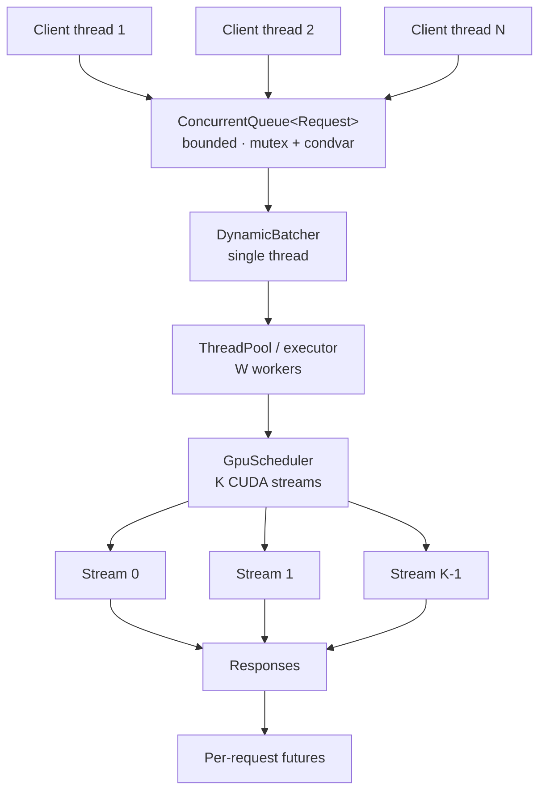

# Concurrency Architecture

How requests get from many client threads onto a GPU, and why each piece is
shaped the way it is.

## The pipeline

Each stage exists to decouple a rate mismatch:

| Stage | Decouples | Failure mode without it |
| --- | --- | --- |
| Bounded queue | arrival rate from service rate | unbounded latency, then OOM |
| Batcher | request granularity from GPU granularity | one kernel launch per request |
| Worker pool | batch formation from batch execution | formation stalls during execution |
| Stream scheduler | copies from compute | GPU idle during every transfer |
