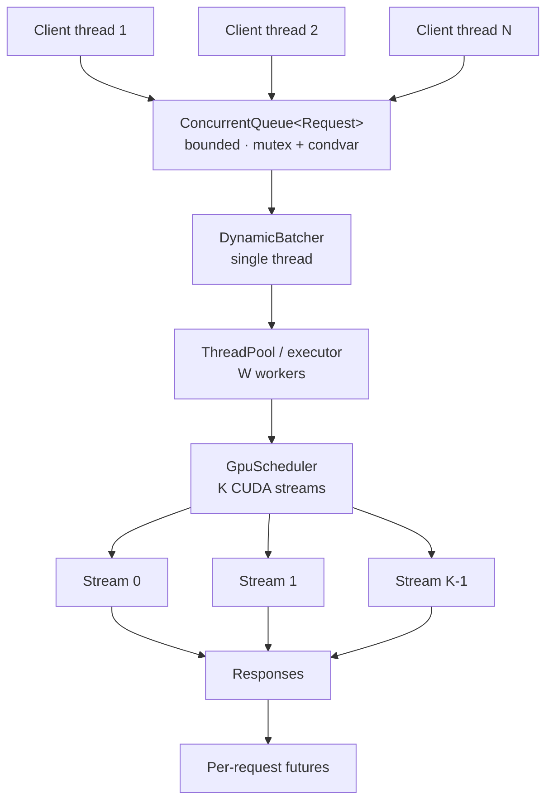

# Concurrency Architecture

How requests get from many client threads onto a GPU, and why each piece is
shaped the way it is.

## The pipeline



Each stage exists to decouple a rate mismatch:

| Stage | Decouples | Failure mode without it |
| --- | --- | --- |
| Bounded queue | arrival rate from service rate | unbounded latency, then OOM |
| Batcher | request granularity from GPU granularity | one kernel launch per request |
| Worker pool | batch formation from batch execution | formation stalls during execution |
| Stream scheduler | copies from compute | GPU idle during every transfer |

## Why a mutex, not atomics

The queue protects a composite invariant, not a single word. A producer must
observe "not closed AND not full" and then insert, with no window in between
where another thread could close the queue or take the last slot.

Atomics cannot express a check-then-act over two pieces of state. A lock-free
formulation would need a CAS over a value encoding both, plus a solution for
the ABA problem, and would still need somewhere for blocked producers to wait.
For a queue crossed once per request — not once per kernel — the mutex is not
on any hot path worth optimising.

The measurable claim is in `benchmarks/benchmark_queue.cpp`, which sweeps
producer and consumer counts and shows where the single lock stops scaling. If
that point sits below the target concurrency, the fix is sharding the queue,
not removing the lock.

## Why condition variables, not polling

A consumer waiting on an empty queue has nothing useful to do. The options are:

| Approach | Cost |
| --- | --- |
| Spin | burns a core; on an oversubscribed machine, steals cycles from the producer it waits for |
| Sleep-and-retry | adds latency quantised to the sleep interval; wrong at both ends |
| Condition variable | thread parks in the kernel; producer's notify wakes it at the state change |

The condition variable is the only one that is both cheap while idle and prompt
when work arrives.

### Spurious wakeups

`wait` may return without a matching notify. Every wait in
[`concurrent_queue.hpp`](../cpp/include/cudaforge/concurrent_queue.hpp) uses the
predicate overload, which re-checks the condition and loops. There is no bare
`wait(lock)` in the file, and there must not be — one would let a consumer
proceed to pop from an empty deque.

### Lock ownership

`std::unique_lock` rather than `std::lock_guard`, because
`condition_variable::wait` must release and reacquire the mutex. Notifications
are issued after the lock is released, so a woken thread does not immediately
block on a mutex the notifier still holds.

## Backpressure

The queue is bounded. That is a design decision with consequences worth being
explicit about.

An unbounded queue never rejects anything, which sounds better than it is. Under
sustained overload it converts a throughput problem into two worse problems:
memory grows without limit, and queue delay grows without limit — so every
request eventually times out, including ones that could have been served. The
system fails late and totally instead of early and partially.

A bounded queue forces a choice at the ingress, and CudaForge exposes both:

| Call | Behaviour when full | Use when |
| --- | --- | --- |
| `push` / `submit` | blocks the caller | the caller can slow down — batch clients, load generators |
| `try_push` / `try_submit` | returns `Full` immediately | the caller cannot slow down — an HTTP frontend that should return 503 |

The HTTP server uses the second. A client holding a connection open behind a
full queue turns a throughput problem into a connection-exhaustion problem;
returning 503 lets the client retry or fail fast.

## Shutdown

Shutdown must not lose accepted work and must not hang.

```
shutdown()
  ├─ set closed_               producers begin failing
  ├─ notify_all on both CVs    every blocked thread wakes and re-checks
  └─ join                      workers exit as their loops return Closed
```

The rule that makes this safe: **a closed queue with items still in it returns
`Ok`, not `Closed`.** Consumers keep draining; only an empty *and* closed queue
reports `Closed`. Work already accepted is therefore always executed.

`shutdown()` is idempotent everywhere it appears, and every destructor calls it.
The engine additionally fails any future still outstanding after the drain —
otherwise a caller blocked in `result()` would hang until its timeout with no
explanation.

## Dynamic batching

GPU inference is dominated by weight movement, not arithmetic: running one
request through a transformer layer reads the same weights as running sixteen.
Batching amortises that read, so throughput rises close to linearly with batch
size until the kernel becomes compute-bound.

The cost is latency. A request arriving into an empty queue would be fastest
executed immediately; batching makes it wait. A batch therefore closes on
whichever comes first:

1. it holds `max_batch_size` requests, or
2. the **oldest** request in it has waited `max_wait`.

### The deadline is anchored, not sliding

```
t=0    request A arrives, deadline set to t=5ms
t=1ms  request B arrives, deadline unchanged
t=2ms  request C arrives, deadline unchanged
t=5ms  batch [A, B, C] executes
```

If the deadline were reset on each arrival, a steady stream would postpone
execution indefinitely and no request would have a bounded wait — the classic
Nagle-style starvation bug. Anchored to the oldest request, nothing waits longer
than `max_wait` plus the batch's own service time.

`tests/python/test_scheduler.py::test_the_deadline_is_anchored_to_the_oldest_request`
and the matching C++ case assert exactly this, by trickling requests faster than
the deadline and requiring that batches still close.

### Batch formation is single-threaded

Formation is an inherently serial decision. Two threads racing to claim requests
from one queue would need a lock that serialises them anyway, and would make the
deadline non-deterministic. Parallelism belongs downstream: the batcher hands
each formed batch to a worker pool and immediately returns to forming the next.

If the batcher executed batches itself, no batch could form while one ran, and
arrival-time batching would collapse into strict serialisation — every batch
would be a full one assembled from the backlog that accumulated during the
previous execution, regardless of the configured wait.

### Reading the trigger counters

`batches_closed_by_size` and `batches_closed_by_timeout` are reported separately
because average batch size alone cannot distinguish two very different states:

| Observation | Meaning | Action |
| --- | --- | --- |
| Nearly all timeout closures, small batches | arrival rate too low to fill a batch | lower `max_wait`; it is pure added latency |
| Nearly all size closures, queue depth rising | saturated | raise `max_batch_size`, or add capacity |
| Mixed, batch size near the limit | well matched | leave it alone |

## Deadline-aware admission

Backpressure decides whether to *accept* a request. Deadlines decide whether an
already-accepted request is still worth *running*.

Under overload the queue deepens until requests spend longer waiting than their
clients are willing to wait. Executing them anyway is worse than useless: the
result is discarded, and the capacity it consumed was needed by requests someone
is still waiting for. That deepens the backlog that caused the timeouts, so the
system degrades faster the harder it is pushed.

A request may therefore carry a deadline:

```python
engine.submit(prompt, deadline_seconds=2.0)   # or deadline_seconds in the HTTP body
```

Expired requests are dropped, counted as `requests_expired`, and their futures
are **failed with a stated reason** — never left hanging, which would reproduce
the very timeout the deadline exists to avoid.

### Checked twice, and why

The check happens at two points, because the wait happens at two points:

| Site | Catches |
| --- | --- |
| Batcher dequeue | backlog in the request queue |
| Immediately before execution | backlog in the **executor** queue |

The second is the one that usually fires. The batcher forms batches far faster
than they execute, so it drains the request queue promptly and the real backlog
accumulates behind the worker pool. A request can therefore be dequeued well
within its deadline and still be long past it by the time a worker picks it up.

This was not obvious from the design and was found by a test: an
executor-saturating workload dropped nothing until the second check was added.

### Three counters, three different problems

| Counter | Cause | Remedy |
| --- | --- | --- |
| `requests_rejected` | queue was full at admission | raise `queue_capacity`, if latency allows |
| `requests_expired` | queue is deeper than clients will wait for | shed earlier, or add capacity |
| `requests_failed` | execution raised | a bug, or a bad request |

Collapsing these into one "errors" number would hide the distinction that
determines what to actually do.

## The thread pool

A fixed set of workers over a bounded task queue. Two details are load-bearing.

**Counters are relaxed atomics, not mutex-protected.** They are independent
single words updated on the hot path; taking the queue's mutex to bump one would
serialise workers that otherwise never interact. Relaxed ordering is correct
because nothing is published through these counters — no reader uses them to
establish happens-before. The consequence is that a stats snapshot is not an
atomic view of the pool, which is why no invariant is derived across fields.

**A throwing task must not kill its worker.** If it did, the pool would silently
lose capacity one task at a time until it deadlocked with an empty worker set.
Exceptions are counted and swallowed in the worker loop; callers who need the
error use `submit_with_result`, where it is stored in the future.

## What the tests actually verify

Concurrency bugs do not reproduce on demand, so the suite asserts properties
rather than sequences:

| Property | Test |
| --- | --- |
| Capacity is never exceeded, observed from outside | `capacity is never exceeded under concurrent producers` |
| Every item is consumed exactly once | `every produced item is consumed exactly once` |
| Blocked producers and consumers are released by shutdown | `a blocked producer is released by shutdown` |
| Accepted work survives shutdown | `shutdown drains buffered items before reporting Closed` |
| Backpressure caps depth rather than growing | `a bounded queue applies backpressure rather than growing` |
| A failing task does not reduce pool capacity | `a throwing task does not kill its worker` |

### Assertions never run on worker threads

Catch2's `REQUIRE` macros are not thread-safe — they manipulate per-run state
including an output redirect that asserts if two threads activate it at once.
Calling them off the main thread produces an abort whose timing depends on the
scheduler, so the failure looks intermittent and unrelated to the code under
test. This was observed here as a sporadic `SIGABRT` under AddressSanitizer.

Concurrency tests therefore funnel checks through
[`thread_assert.hpp`](../tests/cpp/thread_assert.hpp), an atomic failure
counter, and assert once on the main thread after every worker is joined.

## Sanitizer coverage

The portable runtime is built and run under three sanitizers. All three pass on
the development host:

```bash
./scripts/build.sh --sanitizer thread    && ./build-thread/tests/cpp/cudaforge_tests
./scripts/build.sh --sanitizer address   && ./build-address/tests/cpp/cudaforge_tests
./scripts/build.sh --sanitizer undefined && ./build-undefined/tests/cpp/cudaforge_tests
```

ThreadSanitizer is the important one here: it instruments every memory access
and reports a race even when the interleaving that would expose it did not
occur during the run. That is the only practical way to have any confidence in
concurrent code, because testing alone samples a vanishing fraction of the
possible schedules.

The sanitizers are mutually exclusive at the ABI level — TSan and ASan
instrument allocations differently and cannot be linked together — which is why
`CUDAFORGE_SANITIZER` is a single-valued option rather than several booleans,
and why each gets its own build directory.
